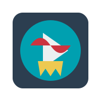

# Debrid Media Manager



Start building your media library with truly unlimited storage size!

## What is this?

Fork of [Debrid Media Manager](https://github.com/debridmediamanager/debrid-media-manager) with pending pull requests merged (as of time of writing) and some updated dependencies.

## Features

This builds on top of the amazing service brought by [Real-Debrid](http://real-debrid.com/?id=9783846)\*, [AllDebrid](https://alldebrid.com/?uid=1kk5i&lang=en)\*, and [TorBox](https://torbox.app).

### Library management

You can see all your torrents in one page, sort them by name, by size, by "quality score", etc. It groups all your torrents by title and delete duplicate files. It can show you failed or slow downloads and delete them.

### Torrent search

You can add more content to your library by searching the DHT (powered by BtDigg). It detects what you already have downloaded and currently downloading in your library too.

### Share your library and mirror other libraries

You can share your whole collection or select specific items you want to share. Head over to [r/debridmediamanager](https://www.reddit.com/r/debridmediamanager/) and see other people's media collections and easily mirror their content to yours.

## Setup

0. Signup for a free tier plan at [Avien](https://console.aiven.io/signup?referral_code=y43qqw0jci61b1ahfqo9)\*\* or [Filess](https://filess.io/) - this is a serverless MySQL database hosted in the cloud - or spin up a self-hosted MySQL instance.
1. Have Tor running at `127.0.0.1:9050` (needed for DHT search; if you don't need your own search database then refer to the section [External Search API](https://github.com/debridmediamanager/debrid-media-manager#external-search-api))
2. Clone this repository and go to the directory
3. Create a copy of the `.env` file `cp .env .env.local` and fill in the details
4. Fill in required settings in `.env.local` (e.g. `PROXY=socks5h://127.0.0.1:9050` if tor is running on your host machine)
5. Get your Prisma database connection string from Filess console and put that in your `.env.local` file
6. Install the dependencies `npm i`
7. This is a Next.js project so either go with `npm run dev` or `npm run build && npm run start`
8. Head to `localhost:3000` and login

_\* Referral link. Provides $100 USD credit for trial of non-free-tier features._
_\*\* Referral link, from [upstream](https://github.com/debridmediamanager/debrid-media-manager)._

### Docker

```shell
cp .env .env.local
docker compose -c docker-compose.yml up -d
```

The website will be accessible at `http://localhost:3000`

## FAQ

See [FAQ](https://github.com/debridmediamanager/debrid-media-manager/#FAQ)
